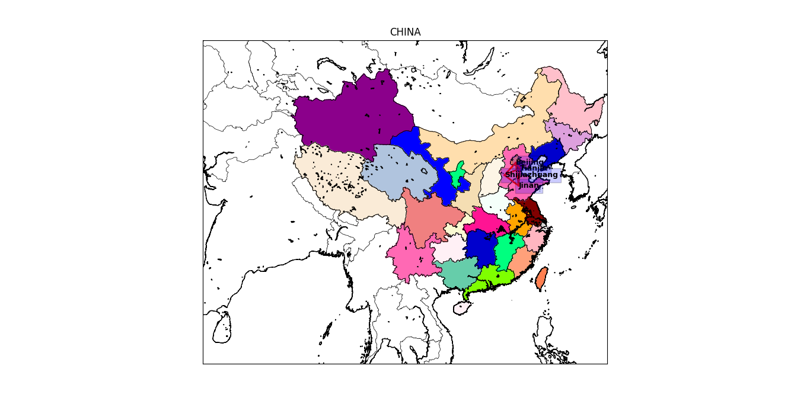
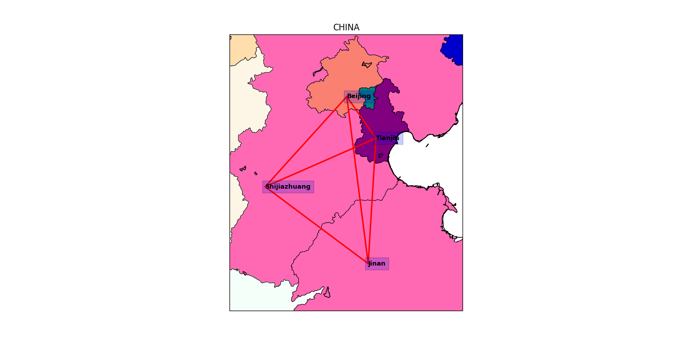

# mapVisualization
mapVisualization
```
pip install pillow/basemap/matplotlib/numpy/pyproj
```

1. CHN_adm_shp	为中国各省数据文件
   TWN_adm_shp  为台湾数据文件

2. mapVisual.py 为实现逻辑代码

3. citydist.sql 	为建表语句  
   citydistWithData.sql 为运行成功后导出的sql语句

4. mysqlData.png 为存储在数据库中的数据
    
   -  id         代表索引值
   -  start_city 代表起点城市
   -  end_city   代表终点城市
   -  start_lat  代表起点纬度
   -  start_lon  代表起点经度
   -  end_lat    代表终点纬度
   -  end_lon    代表终点经度
   -  dist_city  代表计算出的起点和终点的距离


5. CHINA.png 为绘制的全局中国地图


6. DIST.png  为局部放大的四个GPS点标记以及连线


[参考1](http://www.cnblogs.com/yejingcn/p/4537863.html)
[参考2](http://basemaptutorial.readthedocs.io/en/latest/search.html?q=rgb2hex&check_keywords=yes&area=default)
[参考3](https://www.zhihu.com/question/49669755)
[参考4](http://blog.csdn.net/zm714981790/article/details/51224650)
[参考5](http://blog.csdn.net/ouening/article/details/55227364)